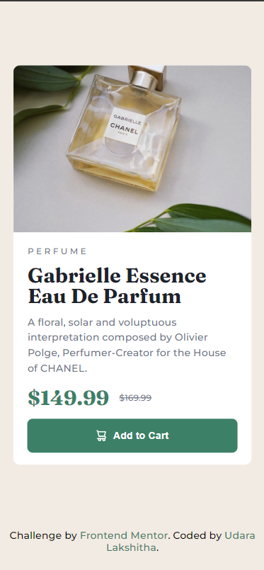
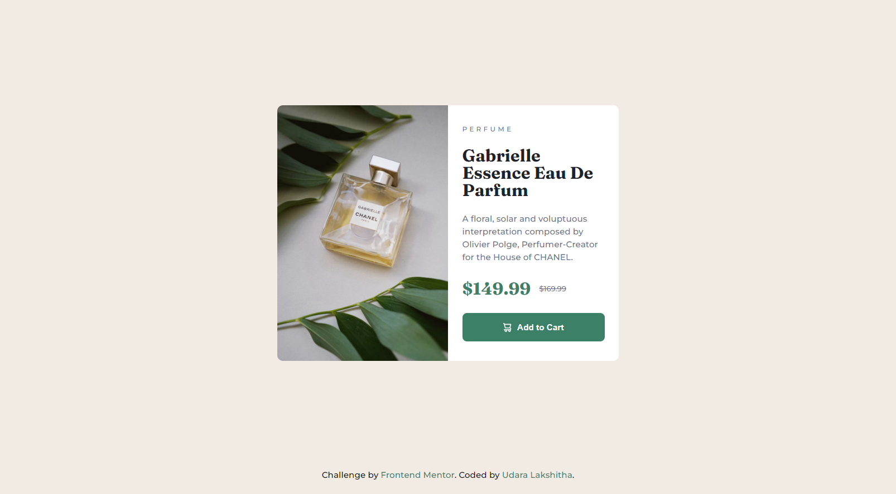

# Frontend Mentor - Product preview card component solution

This is a solution to the [Product preview card component challenge on Frontend Mentor](https://www.frontendmentor.io/challenges/product-preview-card-component-GO7UmttRfa). Frontend Mentor challenges help you improve your coding skills by building realistic projects. 

## Table of contents

- [Overview](#overview)
  - [The challenge](#the-challenge)
  - [Screenshot](#screenshot)
  - [Links](#links)
- [My process](#my-process)
  - [Built with](#built-with)
  - [What I learned](#what-i-learned)
  - [Continued development](#continued-development)
  - [Useful resources](#useful-resources)
- [Author](#author)


## Overview
This challenge focuses on building a responsive product preview card component. The main goal is to create an attractive and functional product display that adapts seamlessly to different screen sizes. The component includes product images, pricing information, and an "Add to Cart" button.

The project is perfect for practicing responsive design techniques, CSS layout methods like Flexbox or Grid, and implementing interactive hover states. It's an excellent opportunity to work with HTML semantic markup and CSS styling while ensuring the component looks polished on both desktop and mobile devices.


### The challenge

Users should be able to:
- View the optimal layout depending on their device's screen size
- See hover and focus states for interactive elements

### Screenshot



### Links

- Solution URL: [Add solution URL here](https://your-solution-url.com)
- Live Site URL: (https://ul-code.github.io/product-preview-card_FM/)

## My process

### Built with

- Semantic HTML5 markup
- CSS custom properties
- Flexbox
- Mobile-first workflow


          
### What I learned

1. **Responsive Images with Picture Element**:
   I learned how to use the `<picture>` element with media queries to serve different images based on viewport width:
   ```html
   <picture>
     <source srcset="./images/image-product-desktop.jpg" media="(min-width: 48rem)">
     
   </picture>
   ```
   This technique helps optimize image delivery for different screen sizes.
   Reference: [Picture Element Documentation](https://web.dev/learn/design/picture-element)

2. **Consistent Font Sizing with REM**:
   I implemented a scalable font system using REM units, making the typography responsive and maintainable. Setting the root font-size to 62.5% (10px) made REM calculations more intuitive:
   ```css
   html {
       font-size: 62.5%;
   }
   ```

3. **Interactive Button States**:
   I learned to enhance button interactivity using the `:active` pseudo-class:
   ```css
   .add-to-cart:active {
       background-color: var(--color-green-700);
   }
   ```

4. **CSS Custom Properties**:
   I utilized CSS variables for consistent color management throughout the project:
   ```css
   :root {
     --color-green-500: hsl(158, 36%, 37%);
     --color-green-700: hsl(158, 42%, 18%);
   }
   ```

### Continued development

Moving forward, I plan to focus on several key areas to enhance my development skills:

1. **Advanced CSS Grid Layouts**
   - Master complex grid systems
   - Implement responsive grid patterns
   - Explore grid-template-areas for layout management

2. **CSS Animation and Transitions**
   - Create smooth, performant animations
   - Implement more sophisticated hover effects
   - Learn keyframe animations for enhanced interactivity

3. **Accessibility Best Practices**
   - Improve ARIA implementation
   - Enhance keyboard navigation
   - Ensure proper semantic HTML structure

4. **CSS Architecture**
   - Explore BEM methodology more deeply
   - Implement CSS custom properties more effectively
   - Study scalable CSS organization patterns


### Useful resources

- [Frontend Mentor Learning Path: Building Responsive Layouts](https://www.frontendmentor.io/learning-paths/building-responsive-layouts--z1qCXVqkD) - This guide helped me understand responsive design principles and best practices.

- [Picture Element Documentation](https://web.dev/learn/design/picture-element) - This resource was invaluable for learning how to implement responsive images properly. It provides clear examples and explain each step.

## Author

- Frontend Mentor - [@UL-code](https://www.frontendmentor.io/profile/UL-code)

